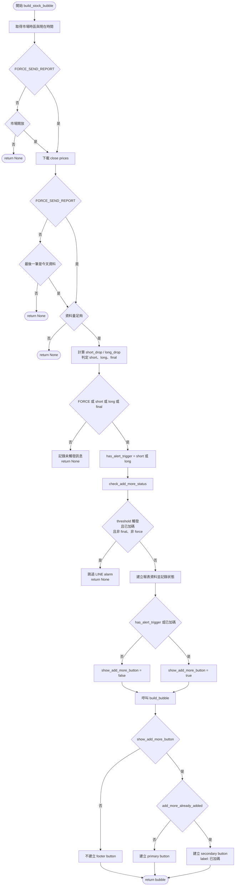

# Stock Alert 決策流程

本圖依目前 [check_stock.py](check_stock.py) 的 `build_stock_bubble()`、`_should_send_report()`，以及 [flex_msg_tpl.py](flex_msg_tpl.py) 的 `build_bubble()` 整理。

## 判斷重點

- `FORCE_SEND_REPORT`、threshold 觸發、final report 任一成立時，才會進入後續報表流程並查詢加碼狀態。
- 只有一般的 threshold alarm，且已加碼、不是 final、也不是 force 時，才會跳過 alarm。
- 按鈕顯示條件是 `has_alert_trigger or add_more_already_added`，不直接使用 `is_final_report` 或 `FORCE_SEND_REPORT` 判斷。
- `add_more_already_added` 為 `true` 時，按鈕使用 `secondary`／「已加碼」樣式；為 `false` 時，若因 threshold 顯示按鈕，使用 `primary` 樣式。